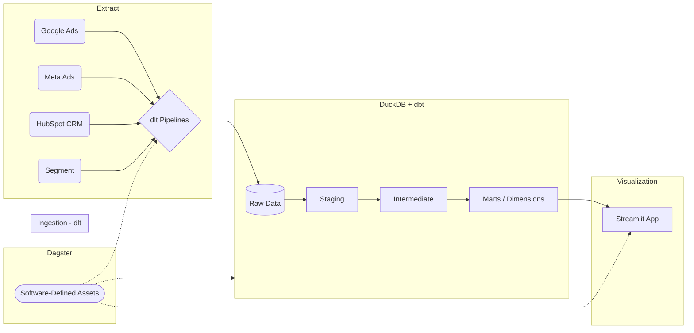

# B2B SaaS RevOps: End-to-End Modern Data Stack

> **A production-grade Analytics Engineering Data Platform** mapping the entire Customer Journey from Anonymous Ad Click (Marketing) to Enterprise Revenue (CRM), built with the Modern Data Stack.


## 🏗️ Architecture

This repository is transitioning from a standalone dbt project to a fully orchestrated **Modern Data Stack (MDS)**.



---

## 🎯 B2B RevOps Problems Solved

This is not a generic "SELECT * FROM sales" warehouse. It solves three of the hardest problems in B2B SaaS Analytics Engineering:

### 1. The "Lead vs. Account" Isolation (Identity Resolution)
* **The Problem:** Sales sells to "Accounts" (Companies), but Marketing acquires "Leads" (People). Anonymised traffic from Segment or Facebook doesn't natively map to Enterprise deals in HubSpot.
* **The Solution:** We built `int_identity_resolution.sql` which isolates B2B domains (filtering out Gmail/Yahoo) via Window Functions (`FIRST_VALUE`), mapping every contact to a "Virtual Account". `fct_pipeline_revenue.sql` uses this to attribute $100K+ Closed Won deals to the very first marketing channel that touched the company's "Champion".

### 2. Multi-Platform Schema Chaos (DRY Macros)
* **The Problem:** Meta Ads costs are in cents. Google Ads are in micros. LinkedIn is in USD. Writing the same cleaning logic 3 times breaks the DRY principle and increases tech debt.
* **The Solution:** Developed a central `generate_stg_ad_performance()` Jinja macro. It standardizes schemas, handles complex DuckDB implicit casting assertions, and reduces 200+ lines of SQL to just 15 lines of macro calls.

### 3. Destruction of Historical Context (SCD Type 2)
* **The Problem:** When a lead moves from MQL to SQL, HubSpot overrides their `lifecycle_stage`. Yesterday's data is lost forever, making it impossible to calculate exact *Pipeline Velocity* (e.g. "How long did it take this lead to become an SQL?").
* **The Solution:** Configured `dbt snapshots` (YAML config driven, dbt v1.9+) using a `check` strategy on `lifecycle_stage`. Downstream, `int_contact_time_in_stage` calculates the exact `days_in_stage` metric for every lead.

---

## 📦 Stack Breakdown

| Layer | Component | Purpose |
|---|---|---|
| **Ingestion** | `dlt` (Data Load Tool) / Python | Extracts API data from HubSpot, Meta, etc., and loads it into DuckDB. |
| **Storage** | DuckDB | Blazing fast, local-first analytical database. |
| **Transformation**| dbt Core | Dimensional modeling, data testing (`dbt_expectations`), SCD2 Snapshots. |
| **Orchestration** | Dagster | Asset-based orchestration ensuring data runs sequentially. |
| **Visualization** | Streamlit | Clean, interactive Python dashboards for RevOps teams. |

---

## 🚀 Quick Start (dbt Only)

Until the Dagster orchestrator is fully deployed, you can verify the dbt logic locally:

```bash
# 1. Activate the environment
source /home/farrux/data_projects/marketing_analytics/venv/bin/activate
cd my_marketing_project

# 2. Generate new B2B Mock Data seeds
python scripts/generate_seeds.py

# 3. Load seeds & Build all metrics
dbt seed --full-refresh
dbt build
```

---

## 🧱 Data Layer Conventions

* **Staging (`stg_*`)**: `TRY_CAST` defensive typing, `ROW_NUMBER` deduplication.
* **Intermediate (`int_*`)**: Cross-source joins, Identity Resolution, Anomaly flags.
* **Marts (`fct_*`, `dim_*`)**: Star schema. `fct_pipeline_revenue` is the Crown Jewel mapping Marketing acquisition to CRM Revenue.
