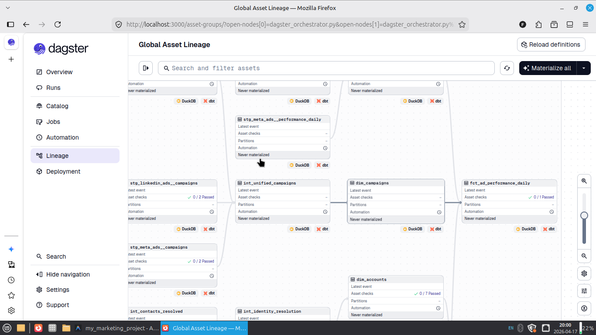

# Lead-to-Account: B2B SaaS RevOps Revenue Engine

> **Marketing Analytics Warehouse** — Map the entire B2B Customer Journey, from the first anonymous ad click to a $100K+ enterprise deal, in a single platform.

[](https://farrux05-ai.github.io/lead-to-account/)
[](https://github.com/farrux05-ai/lead-to-account)
[](LICENSE)

---

## 🏗️ Project Architecture

The project is built on a **fully automated** data pipeline. Every row of data passes through the following stages:

```
Hubspot CRM (Mock API)
        │  dlt (Data Load Tool)
        ▼
    DuckDB (Local Warehouse)
        │  dbt Core (56+ models and tests)
        ▼
   Staging → Intermediate → Marts
        │  Dagster (Orchestration)
        ▼
   Streamlit Dashboard
```


### Stack:
| Layer | Tool | Role |
|---|---|---|
| **Ingestion** | `dlt` | Automated loading from HubSpot |
| **Warehouse** | `DuckDB` | High-performance local analytical storage |
| **Transformation** | `dbt Core` | 3-layer modular data modeling |
| **Orchestration** | `Dagster` | Asset-based pipeline management |
| **Visualization** | `Streamlit` | Interactive RevOps cockpit |

---

## ⚙️ Dagster Orchestration (Asset Lineage)

The project leverages **`dagster-dbt`** integration to treat every dbt model as a standalone "asset". This means the state, dependencies, and execution logs of each model are fully visible and manageable within the Dagster UI.



> The image above showcases **56 dbt models** (staging, intermediate, marts) and their relationships. Transformations are only triggered after the ingestion layer successfully lands.

---

## 📊 Full-Funnel Dashboard

### 1. KPI & Revenue Tracking
Direct link between marketing spend and closed-won revenue.


### 2. Platform Efficiency (CPC & CTR)
Identify which ad platform offers the highest ROI and lowest cost per lead.


### 3. Traffic & Sessions (GA4)
Daily traffic flow and breakdown by source from Google Analytics 4.


### 4. Lead Funnel
Visualize progression through MQL → SQL → Deal stages to identify bottlenecks.


### 5. dbt Data Lineage
End-to-end impact analysis — see exactly where data originates and how it transforms.


---

## 🚀 Getting Started

```bash
# 1. Clone the repository
git clone https://github.com/farrux05-ai/lead-to-account.git
cd lead-to-account/my_marketing_project

# 2. Setup virtual environment and install dependencies
python3 -m venv venv
source venv/bin/activate
pip install -r requirements.txt

# 3. Download dbt packages
dbt deps

# 4. Run the full pipeline (Ingestion + Modeling + Testing)
dagster asset materialize --select "*" -f scripts/dagster_orchestrator.py

# 5. Launch the dashboard
streamlit run streamlit_app.py
```

---

## 🛡️ Data Quality

We enforce strict B2B data quality using `dbt_expectations`:
- **Domain Validation:** Filters out personal email domains (Gmail/Yahoo) to focus on B2B accounts.
- **Surrogate Key Integrity:** Ensures 100% join rates across dimensional and fact models.
- **Identity Resolution:** Maps floating leads to Virtual Accounts based on domain intelligence.
- **SCD Type 2:** Monitors historical CRM changes using dbt Snapshots.

---

## 🔗 Useful Links

- 📚 **[Interactive dbt Documentation](https://farrux05-ai.github.io/lead-to-account/)** — Full model catalog and lineage
- 🐙 **[GitHub Repo](https://github.com/farrux05-ai/lead-to-account)** — Source code and implementation details
