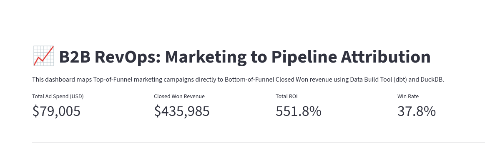
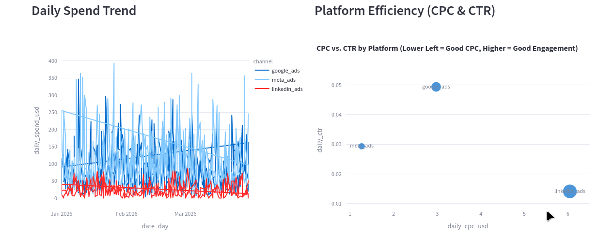
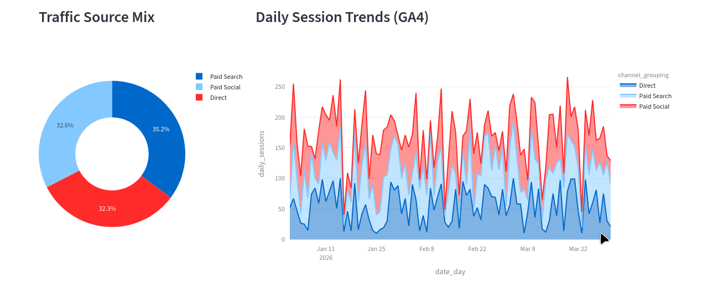
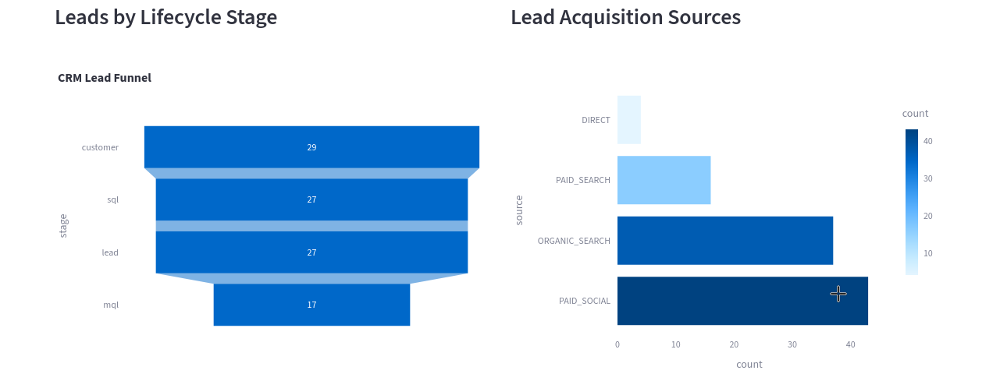
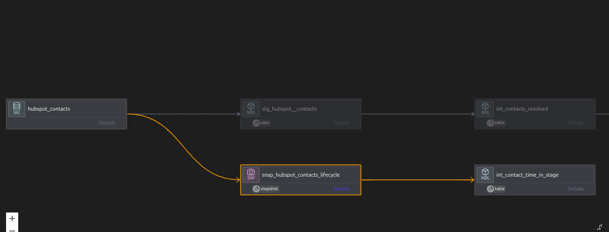

# Lead-to-Account: B2B SaaS RevOps Revenue Engine

> **High-Performance Marketing Analytics Warehouse** mapping the entire B2B Customer Journey — from anonymous Ad clicks to $100K+ Enterprise Deals.

[](https://farrux05-ai.github.io/lead-to-account/)
[](https://github.com/farrux05-ai/lead-to-account)
[](LICENSE)

---

## 🏗️ System Architecture

Our Modern Data Stack (MDS) architecture is designed for speed, scale, and cross-channel visibility. It bridges the gap between Marketing activity and CRM Revenue.



### The Functional Layers:
*   **Ingestion (ELT):** **dlt** (Data Load Tool) extracts raw data from HubSpot and Mock APIs directly into DuckDB.
*   **Warehouse:** **DuckDB** serves as the high-performance local analytical core.
*   **Transformation & Modeling:** **dbt Core** handles the heavy lifting—from modular staging to complex identity resolution and final revenue marts.
*   **Orchestration:** **Dagster** manages "Software-Defined Assets," ensuring that data is only transformed once the ingestion layer successfully lands.
*   **BI & Visualization:** **Streamlit** provides an interactive, B2B-tailored cockpit for RevOps teams.

---

## 📸 Live Full-Funnel Dashboard

Our **Full-Funnel Platform** provides real-time visibility into the B2B revenue engine.

### 1. Revenue & ROI Overview
Tracks Closed-Won dollars directly back to original marketing sources.


### 2. Ad Efficiency (CPC & CTR)
Monitors platform-wide spend and identifies high-engagement, low-cost channels.


### 3. Traffic & Engagement (GA4)
Visualizes daily session trends and traffic mix from Google Analytics 4.


### 4. Lead Funnel & Velocity
Tracks the progression of MQLs, SQLs, and Deals through the sales pipeline.


---

## 🧠 Data Engineering & Lineage

The warehouse architecture follows a strict **Medallion-inspired** modular structure. We ensure data integrity through 50+ automated dbt tests and detailed lineage tracking.



### Key Engineering Features:
*   **Identity Resolution:** Maps floating Leads to Virtual Accounts based on domain intelligence.
*   **SCD Type 2 Tracking:** Uses dbt Snapshots to monitor historical CRM lifecycle changes.
*   **Currency Normalization:** Standardizes multi-currency ad spend into a unified USD reporting layer using custom Jinja macros.

---

## 🚀 Getting Started

### 1. Setup & Execution
```bash
# Clone and enter the project
git clone https://github.com/farrux05-ai/lead-to-account.git
cd lead-to-account/my_marketing_project

# Install dependencies
pip install -r requirements.txt

# Run the full orchestrated pipeline (Injest + Model + Test)
python scripts/dagster_orchestrator.py

# Launch the BI platform
streamlit run streamlit_app.py
```

---

## 🛡️ Data Quality
We enforce strict B2B data quality using `dbt_expectations`:
*   **Domain Validity:** Prevents free-tier emails (Gmail/Yahoo) from polluting account metrics.
*   **Surrogate Integrity:** Ensures 100% join rates across dimensional and fact models.
*   **Relationship Mapping:** Validates that every deal is anchored to a resolved account.

---

## 🔗 Interactive Documentation
The full model documentation, interactive lineage, and data dictionary are hosted here:
👉 **[View Project Documentation](https://farrux05-ai.github.io/lead-to-account/)**
